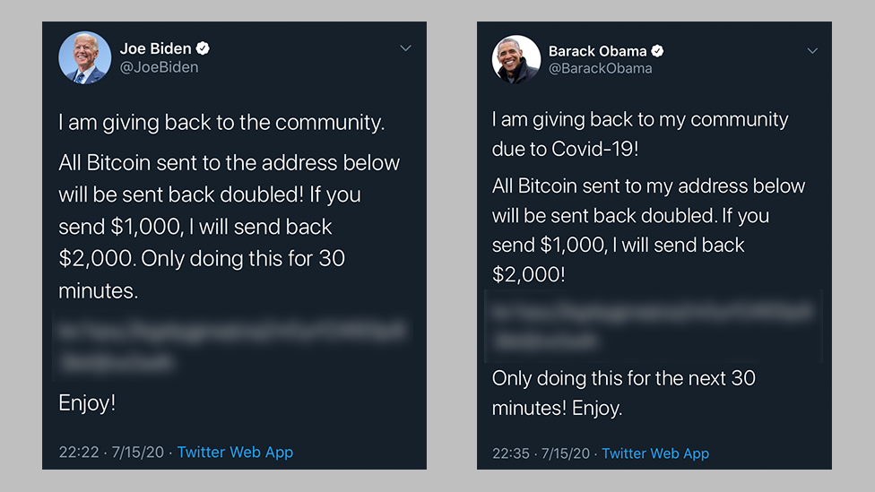

# Kratos Bot
Kratos - [In Greek mythology, Kratos (or Cratos) is the divine personification of strength](https://en.wikipedia.org/wiki/Kratos_(mythology))

## Overview
A Telegram Bot which helps in reducing Scam messages in Public Telegram Group chats which are in the form of photos, like this 
[Image Credits - BBC News](https://www.bbc.com/news/technology-57152924)

The bot, in realtime downloads all the photos sent in the groups it has been added to, looks for texts in the image, 
and checks it out with the predefined set of strings and scores. If the score is above tolerance score, user is muted 
for a day and the message is deleted. 

## Usage
    1. Add [@KratosSpam_bot](https://www.t.me/KratosSpam_Bot) to any group
    2. Promote the Bot to Admin and give it permissions

And that is about it, it should automatically start doing what it needs to do. 

## Technicalities 
    - Bot is made using [Python Telegram Bot API](https://python-telegram-bot.readthedocs.io/en/stable/#)
    - The bot reads images using [OpenCV](https://opencv.org/)
    - Bot finds out the texts in the images using [Tesseract OCR](https://opensource.google/projects/tesseract)
    - Hosted on GitHub Actions, runs entirely there
    - Does not upload any image to anywhere else, everything is done within the GitHub actions runner and is deleted once the OCR is done.
